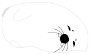

# Seal 
Seal est une collection **/!\ expérimentale /!\\** de composants React dédiés à la construction de tableaux de bord.

Le but de cette collection est de pouvoir tester différentes approches pour la création
de composants React avec le langage [Clojurescript][cljs] qui soit compatible
et utilisable dans un écosystème Javascript. Sans donc que les utilisateur·ices
n’aient besoin de connaitre le langage, ni même qu’iels ne sachent que les
composants soient réalisés avec Clojurescript.
## Licence
Le code source de ce dépot est sous licence MIT. Vous pouvez trouver plus d’informations dans le fichier [LICENSE](LICENSE) ou sur [ce résumé de la licence](https://choosealicense.com/licenses/mit/) (en anglais)

[cljs]: https://clojurescript.org/